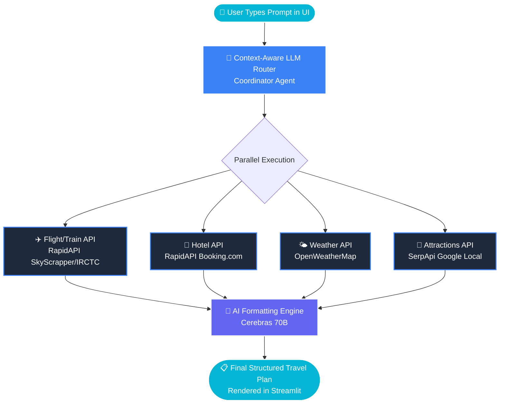

<div align="center">

# 🧭 NavYatra AI

### Multi-Agent Travel Intelligence & Planning System

**6 Specialized AI Agents | Parallel Execution | Real-Time APIs**

[](https://python.org)
[](https://langchain-ai.github.io/langgraph/)
[](https://cerebras.ai)
[](https://fastapi.tiangolo.com)
[](https://streamlit.io)

---

*NavYatra AI transforms a single natural-language travel query into a comprehensive, weather-aware, day-by-day travel plan — powered by 6 coordinated AI agents running in parallel.*

</div>

---

## 📋 Problem Statement & Why We Built This

Planning a trip today means spending **hours juggling 5-6 different platforms** — flight aggregators, hotel booking sites, weather apps, travel blogs, and review sites — and then manually stitching everything into a coherent plan.

| Pain Point | Impact |
|:-----------|:-------|
| **Fragmented Research** | Travelers switch between 5+ platforms with no unified view. |
| **Time Drain** | Average trip planning takes 3-5 hours of manual research. |
| **Weather Blindness** | Plans are made without considering the exact weather conditions. |
| **No Intelligence** | Traditional tools list options but don't rank or summarize them. |

**NavYatra AI solves this** by deploying 6 specialized AI agents that autonomously research, analyze, and synthesize a complete travel plan from a single sentence — all in under 45 seconds.

---

## ✨ How It Works (Multi-Agent Architecture)

NavYatra AI uses a **LangGraph-powered multi-agent architecture**. It intelligently routes queries to specialized agents, executes API calls in parallel, and formats everything beautifully.



---

## 🛠️ Tech Stack & API Roles

### Core Tech Stack
- **LangGraph & LangChain**: Orchestrates the multi-agent parallel execution.
- **Cerebras (Llama 3.3 70B)**: Ultra-fast LLM inference engine.
- **FastAPI**: Robust Python backend to stream server-sent events (SSE).
- **Streamlit**: Beautiful, custom dark-themed UI frontend.

### Live APIs Used
We use 4 distinct APIs to fetch 100% real, live data.

| API Provider | What We Use It For | Data Fetched |
|:-------------|:-------------------|:-------------|
| **RapidAPI (Booking.com)** | Hotels | Exact hotel names, prices adjusted for adults/children, live review scores |
| **RapidAPI (SkyScrapper)** | Flights | Real flight times, airlines, durations, and layovers |
| **RapidAPI (IRCTC)** | Trains | Indian Railways train schedules, availability, and routing |
| **OpenWeatherMap** | Weather | 5-day highly accurate forecasts (temp, wind, rain probability) |
| **SerpApi** | Local Attractions | Live Google Maps data (ratings, reviews count, operating hours) |

---

## 📊 Sample API Data

<details>
<summary><b>🏨 Click to see what the Hotel API returns (Sample JSON)</b></summary>

```json
{
  "hotels": [
    {
      "name": "The Oberoi, New Delhi",
      "price_per_night": 250.00,
      "rating": 4.9,
      "reviews": 1205,
      "distance_to_center": "3 km",
      "amenities": ["Pool", "Free WiFi", "Spa"]
    }
  ]
}
```
</details>

<details>
<summary><b>✈️ Click to see what the Flight API returns (Sample JSON)</b></summary>

```json
{
  "flights": [
    {
      "airline": "IndiGo",
      "flight_number": "6E-2051",
      "departure": "08:30 AM (DEL)",
      "arrival": "11:15 AM (GOI)",
      "duration": "2h 45m",
      "price": 125.50,
      "stops": "Direct"
    }
  ]
}
```
</details>

<details>
<summary><b>🚆 Click to see what the Train API returns (Sample JSON)</b></summary>

```json
{
  "trains": [
    {
      "train_name": "Vande Bharat Exp",
      "train_number": "22439",
      "departure_time": "06:00 AM (NDLS)",
      "arrival_time": "02:00 PM (SVDK)",
      "duration": "8h 00m",
      "classes_available": ["CC", "EC"],
      "running_days": ["Mon", "Wed", "Thu", "Fri", "Sat", "Sun"]
    }
  ]
}
```
</details>

<details>
<summary><b>🌤️ Click to see what the Weather API returns (Sample JSON)</b></summary>

```json
{
  "forecast": [
    {
      "date": "2026-07-10",
      "temperature": 28.5,
      "feels_like": 30.2,
      "condition": "Light Rain",
      "humidity": 78,
      "wind_speed": 4.5
    }
  ]
}
```
</details>

<details>
<summary><b>🎯 Click to see what the Local Attractions API returns (Sample JSON)</b></summary>

```json
{
  "attractions": [
    {
      "title": "Hadimba Devi Temple",
      "rating": 4.6,
      "reviews": 49000,
      "type": "Tourist attraction",
      "operating_hours": "Closed · Opens 8 AM Tue"
    }
  ]
}
```
</details>

---

## 🚀 Getting Started

### Prerequisites
- Python 3.12+
- A `.env` file containing your API keys.

### 1. Clone & Install
```bash
git clone https://github.com/Satyam2006chh/NavYatra-AI.git
cd NavYatra-AI
pip install -r requirements.txt
```

### 2. Configure API Keys
Copy the example environment file:
```bash
cp .env.example .env
```
Inside `.env`, you will need to add your own keys (Do **NOT** commit this file):
- `CEREBRAS_API_KEY`
- `RAPIDAPI_KEY`
- `OPENWEATHERMAP_API_KEY`
- `SERPAPI_KEY`

### 3. Run the Backend
Open a terminal and start the FastAPI server:
```bash
uvicorn backend.main:app --reload
```

### 4. Run the Frontend
Open a **second** terminal and start the UI:
```bash
streamlit run frontend/app.py
```
*Visit `http://localhost:8501` in your browser!*

---

<div align="center">
<b>Built by <a href="https://github.com/Satyam2006chh">Satyam Chhabra</a></b> · NavYatra AI — Your AI Travel Companion 🧭
</div>
